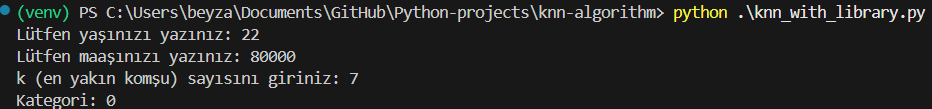
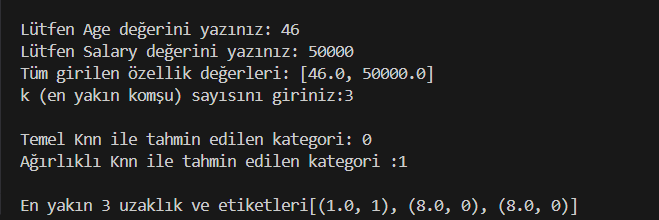
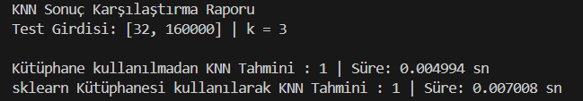

# K-En Yakın Komşu (KNN) Algoritması ile iPhone Satın Alma Tahmini
Bu proje, müşterilerin iPhone satın alıp almayacağını tahmin etmek için K-En Yakın Komşu (KNN) algoritmasını kullanmaktadır. KNN algoritması hem kütüphane kullanılarak hem de kütüphane kullanılmadan yazılarak uygulanmıştır. 

k değerinin kullanıcı tarafından belirlenmesinin sebebi, modelin karmaşıklığını ve duyarlılığını kontrol edebilmek içindir. Küçük k değerleri modelin çok hassas olmasına neden olur, bu da aşırı öğrenmeye (overfitting) yol açabilir. Büyük k değerleri ise modelin genelleme yeteneğini artırır, ancak bu kez de yetersiz öğrenme (underfitting) riski oluşur.

# KNN Algoritması Hakkında
K-En Yakın Komşu (KNN) algoritması, hem sınıflandırma hem de regresyon problemlerinde kullanılan, basit ve etkili bir makine öğrenimi yöntemidir. Bu projede, yalnızca sınıflandırma problemi için KNN algoritması kullanılmıştır. KNN algoritması, yeni bir veri noktasını en yakın k komşusunun sınıfına göre sınıflandırır.

# Veri Seti Hakkında
Veri setinde müşteri bilgileri yer almaktadır ve şu özelliklerden oluşur:

Age (Yaş): Müşterinin yaşı

Salary (Maaş): Müşterinin yıllık maaşı

Purchase Iphone (iPhone Satın Alma): Hedef değişken; müşterinin iPhone satın alıp almadığını belirtir (1 = Evet, 0 = Hayır)

# Projede Kullanılan Yöntemler
Projede iki farklı KNN uygulaması yer almaktadır:

# 1. Kütüphane Kullanarak KNN (knn_with_library.py)
Python’un güçlü makine öğrenimi kütüphanesi scikit-learn kullanılmıştır. KNeighborsClassifier sınıfı ile  model oluşturulup eğitilmiştir. .fit() metodu, modeli eğitim verisiyle eğitirken; .predict() metodu, eğitilmiş modelle yeni veriler üzerinde tahmin yapar.

# 2. Kütüphane Kullanmadan Elle Yazılmış KNN (knn_without_library.py)
KNN algoritmasının mantığını daha iyi anlamak için sıfırdan elle yazılmıştır. Sadece CSV dosyasını okumak için pandas kütüphanesi kullanılmıştır. Eğitim süreci olmadan, tüm veri bellekte saklanır. Yeni bir veri noktası ile tüm veriler arasındaki Öklidyen mesafesi hesaplanır. En yakın k komşunun sınıfına göre çoğunluk oyu ile sınıflandırma yapılır.

# Kullanım
Kütüphane kullanılarak yazılan KNN algoritmasının terminal çıktısı aşağıdadır:

Kütüphane kullanılmadan yazılan KNN algoritmasının terminal çıktısı aşağıdadır:

Kütüphane kullanılmadan ve scikit-learn kütüphanesi ile yazılmış iki farklı KNN algoritmasının tahmin sonuçları ve çalışma süreleri karşılaştırılmıştır.

